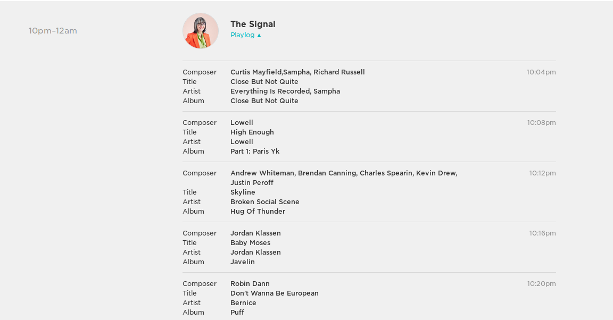
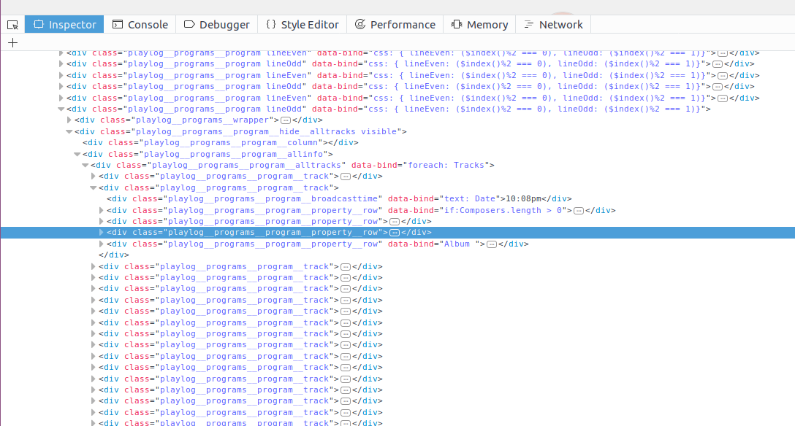
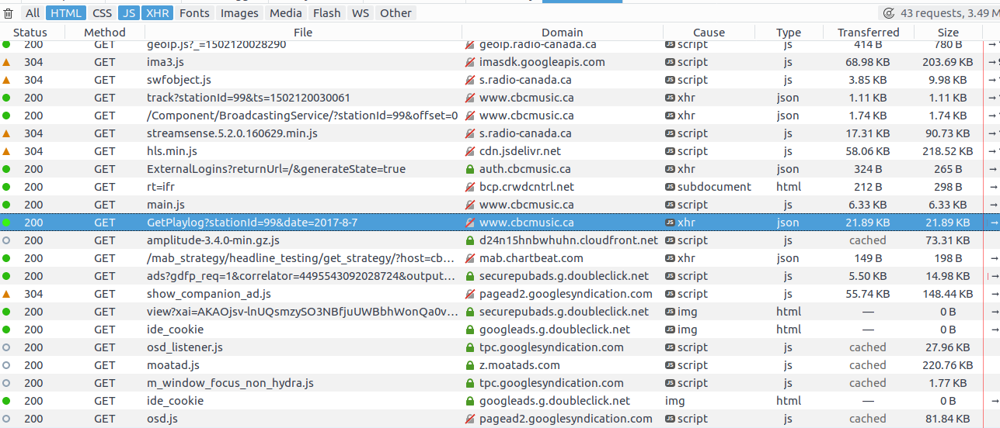
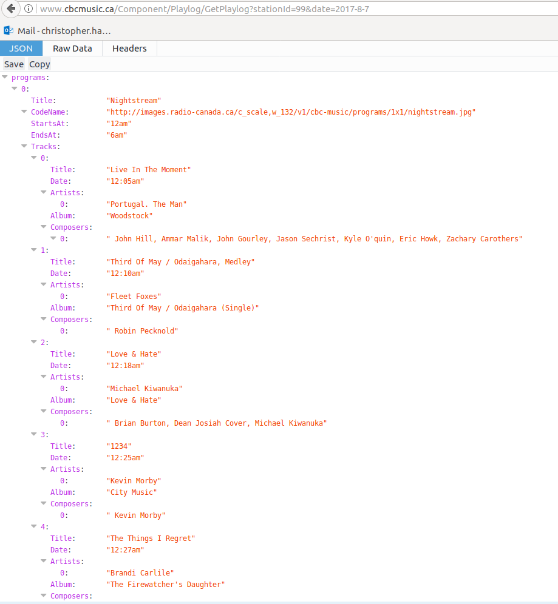

```{r setup, echo = FALSE}
options(stringsAsFactors = FALSE)
knitr::opts_chunk$set(eval = FALSE)
```


## Prologue

After a long hiatus I'm back to blogging with a very important project.

Since I blogged last there have been some changes in my life, I finished
my Master's degree and moved back from Newfoundland to Toronto. I started
a new challenge as a programmer/analyst at a brain imaging research lab
at the Hospital for Sick Children in Toronto. The project is working to understand
the brain differences that underpin Autism Spectrum Disorder, Obsessive Compulsive Disorder,
and Attention Deficit/Hyperactivity Disorder. It's been a wonderful opportunity
to use my data science skills for new challenges. Future blog posts will address some of
my new work, but for now there is an issue very close to my heart I'd like to
present.

## The Signal is Coming to an End

After 10 years of the greatest Canadian radio program (ever), Laurie Brown is ending
her iconic Radio 2 program "The Signal" to move on to new creative adventures. Laurie's
song choices have become enduring favourites, and it saddens me to be losing the show.
I decided it was important to do my part in preserving as much as I
can of the shows history and provide the data for anyone who wants it. 

## The Plan

In this post I'll show some interesting statistics about The Signal, including
most played tracks, most played artists, and play time distributions for those
tracks. I'll also show how I downloaded as many of the show's play logs as possible and
assembled them into a variety of formats. I hope this data will be useful for
music recommendations for years to come. Additionally, I'll show how to use the
spotify API to get streaming links for as many of the tracks as possible.

## The Data

The CBC play logs had the 391 most recent episodes of The Signal available.
In the episodes Laurie played 10,140 tracks over the 782 hours of air time,
in the data set there are 1648 unique tracks to love. Lets look at some top 10's

```{r, eval = TRUE}
suppressPackageStartupMessages({
    library(dplyr)
    library(ggjoy)
})

signal <-
    read.table("signal_frame_full.tsv", header = TRUE) %>%
    mutate(track_artist = paste(Artist, ":", Title))
```


## Top 10 artists

```{r, eval = TRUE}
top_artists <-
    signal$Artist %>%
    table %>%
    sort(decreasing = TRUE) %>%
    head(10)

top_artists
```

Pleased to see Patrick Watson as the most played artist, and Sufjan Stevens in
there. Patrick Watson was played 100 times, so approximately 1/4 of episodes. Given
repetition rates on normal radio programs, it's pretty astonishing the most played
artist appears in only 1/4 of episodes.

## Top 10 tracks

```{r, eval = TRUE}
top_tracks <-
    signal %>%
    .$track_artist %>%
    table %>%
    sort(decreasing = TRUE) %>%
    head(10)

top_tracks
```

Half Moon Run's Turn Your Love comes out on top, played 38 times, although it's a pretty
tight heat at the top with Senior Citizen's Better Off Alone through to Tennyson's Too Long
within 2 plays. My fiance and I have been using this top 10 as a playlist on spotify
the past few nights and I highly recommend it, all ten tracks are exceptional.

## Distribution of Play Counts

```{r, eval = TRUE}
signal %>%
    .$track_artist %>%
    table %>%
    hist
```

Pretty steep decay in play distribution, with over 1000 played fewer than
five times. Digging in a little:

```{r, eval = TRUE}
signal %>%
    .$track_artist %>%
    table %>%
    `==`(1) %>%
    sum
```

545 of the tracks are only played once over the 391 episodes.

## Play Times

Mostly as an excuse to use a joy plot, I decided to look at how uniform the
distribution of play times were for the top 10 tracks.

```{r, eval = TRUE}
create_numeric_time <-
    function(time)
        case_when(nchar(time) < 5 ~ as.numeric(substr(time, 1,2))
             , TRUE ~ as.numeric(substr(time, 1,2)) +
                   as.numeric(substr(time,4,5))/60)

    
signal %>%
    filter(track_artist %in% names(top_tracks)) %>%
    mutate(numeric_time = create_numeric_time(Time)) %>%
    ggplot(aes(x = numeric_time, y = track_artist, group = track_artist)) +
    geom_joy() +
    theme_joy()
               
```

Very cool, there seem to be some starter songs like Tunnel to the Reservoir and
Turn your Love, and some finishers like Silica and Soaked in Gold. And a clear
bimodal pick in Out the Window.

## The Logs

One nice feature of the CBC Radio 2 is that it gives listeners access to
[play logs](http://www.cbcmusic.ca/radio2/playlogs) for each of their music programs.
Here's an example of what the play log looks like.



Now clicking through each day's play log and extracting the useful data would
be a nightmare, so I needed a programmatic solution. Unfortunately, to my knowledge,
CBC doesn't provide a public API for their play log data, so I had to find another way.

## Finding the Logs

I knew the data was somewhere, and if I was lucky there would be a way to download
it directly. Likely there would be an internal API used to fetch the log data.

In firefox I  opened the inspector on the The Signal log



I combed the html for a bit and learned that the play logs were getting set
by the "knockout" javascript framework, but couldn't track down where the
data was coming from. So I switched to the network tab and reloaded the page,
looking for promising GET calls.



The GetPlaylog query highlighted above looks promising. Let's go to that
page



Outstanding, the query servers JSON directly with the whole playlog for the
day. And the query is an easily understandable format. I played with the query
string a bit to see if I could just get The Signal directly, but to
no avail. In any case it's easy to post process and just extract the logs
I want.

## The Code

We'll use some packages for this

```{r}
suppressPackageStartupMessages({
    library(dplyr)
    library(httr)
    library(lubridate)
    library(purrr)
})
```

We use `httr` for handling all the requests, `dplyr` and `purrr` for general
programming ergonomics, and `lubridate` to make doing stuff with dates easier.

Next we're going to write a function that gets us a playlog for a given
date

```{r}
get_day_log <-
    function(day){
        GET(url, query = list(stationId = 99, date = day))
    }
```

The query string needs a stationId (always 99) and a date. The json object
returned by the query is a list with a single list of programs. To unpack
it, we'll use `httr::content` to extract the json as a list. The we'll filter
the `programs` list with the boolean test for the program title being "The Signal"

```{r}
extract_signal <-
    function(get_req){
        tryCatch({
            progs <- content(get_req)$programs
            signal <- Filter(function(prog) prog$Title == "The Signal"
                           , progs)
            signal[[1]]
        }, error = function(e) return(NA))
    }
```

Notice that here I'm not checking http status codes or anything. If anything goes
wrong it with throw an error when I try to unpack the object, and with
the `tryCatch` it'll just return an `NA`. This could certainly be made more
robust, but this is fine for now.

## Getting The Logs

Using `lubridate` we'll set up a date range to query. I experimented with the
query string in the browser and noticed the logs go back somewhere between
one and two years. Interestingly the web interface only lets you go back one
year, but constructing the query ourselves lets us go back a bit further. So
we'll make a date sequence from two years ago to the last episode (August 4th,
2017 at the time of writing.)

```{r}
days <- seq(ymd("2015-08-04"), ymd("2017-08-04"), by = "day")
```

Now we'll loop over over the days and run our GET requests. This will take
some time, as the CBC server can be a bit flaky.

```{r}
signal_data <-
    lapply(days,
           function(day)
               extract_signal(get_day_log(day)))
```

We expect that some days in the beginning won't have logs (too far back)
and weekends for example don't have the show. So we'll filter all the days
where the playlog is `NA`.

```{r}
has_signal <-
    sapply(signal_data, function(x) !identical(x, NA))

signal_days <- days[has_signal]
signal_logs <- signal_data[has_signal]
```

## Tidy Data

Next we want to turn the nested json into a tidy data frame. First we're going
to augment the log object with the day of the program. The json surprisingly
didn't keep track of this

```{r}
signal_logs_dated <-
    mapply(
        function(log, day){
            log$Date <- day
            log
        }
      , log = signal_logs
      , day = signal_days
      , SIMPLIFY = FALSE)
```

Next we're going to write a pretty gnarly function to unpack the json. We
need to loop over the logs (days), and then over the tracks, creating data frame
rows and then binding them all up

```{r} 
signal_frame <-
    lapply(signal_logs_dated, function(log){
        lapply(log$Tracks, function(track){
            with(track
               , data_frame(Title = Title
                          , Artist = Artists[[1]]
                          , Time = Date
                          , Date = log[["Date"]]
                          , Album = Album
                          , Composers =
                                `if`(length(Composers) == 0
                                   , NA
                                   , Composers[[1]])))
        }) %>% bind_rows
    }) %>% bind_rows
```

And now we have a nice tidy table of tracks to explore. But I wasn't done
yet. I wanted to get spotify data so that each track can be accessed easily.

## Spotify

The first thing I had to do to get spotify data was to sign up for
[spotify developer](https://developer.spotify.com/). After signing up
I created an app called "signal_scraping", whitelisted the callback uri
"http://localhost:1410". These steps took a bit of trial and error but I
eventually got set up. I stored my id and secret in a file.

To issue requests against the spotify API I needed to authorize my program
and get an access token.

```{r}
auth <- read.csv("oauth/signal_scraping_auth", header = FALSE)

## Extract the id and secret"
id <- auth[1,2]
secret <- auth[2,2]

## Setup the authentication endpoint and app
spotify_oep <- oauth_endpoint(authorize = "https://accounts.spotify.com/authorize"
                            , access = "https://accounts.spotify.com/api/token")

app_auth <- oauth_app("signal_scraping", key = id, secret = secret)

## Get a token
token <- oauth2.0_token(spotify_oep, app_auth, use_basic_auth=TRUE)
```

Now that I've authenticated I can setup queries against the
[search endpoint](https://developer.spotify.com/web-api/search-item/)

To query subjects and tracks I need to replace spaces in artist/track names
with `+`. Additionally if either includes a comma, I don't know how to
deal with this, so I just take the first element before the comma

```{r}
format_query <-
    function(q)
        strsplit(gsub(" ", "+", q), ",")[[1]][1]
```

Next I need a function that constructs the query strings to get
track/subjects. In this case, if there is an error, I want to
return an empty data frame row, indicating the track isn't on
spotify.

```{r}
find_track <- function(artist, track){
    empty_track <- data_frame(Artist = artist
                              , Title = track
                              , url = NA
                              , spotify_id = NA
                              , spotify_uri = NA)
    tryCatch({
        resp <- 
            GET("https://api.spotify.com/v1/search"
              , query = list(q = sprintf("artist:%s track:%s"
                                       , format_query(artist)
                                       , format_query(track))
                           , type = "track"
                           , limit = 1)
              , config(token = token))

        track_obj <- content(resp)$tracks$items[[1]]
        
        data_frame(Artist = artist
                   , Title = track
                   , url = track_obj$external_urls$spotify
                   , spotify_id = track_obj$id
                   , spotify_uri = track_obj$uri)
    }, error = function(e){
        cat(artist, ":", track, "\n")
        return(empty_track)
    })
}

```

The spotify API returns an even more complex json object, but since I've
limited the query to return 0 or 1 results, I can access the tracks list,
and grab the first item. From this I want to extract the spotify url
this will open spotify to this track. I also want the id and uri for
further programmatic manipulation (like adding them all to a playlist
for example.).

## Getting the spotify data

Let's get the unique tracks, since we don't want to issue more requests than
necessary. Then run the `find_track` function on each track/artist pair.

```{r}
unique_tracks <-
    signal_frame %>%
    mutate(ta = paste0(Artist, " : ", Title)) %>%
    filter(!duplicated(ta))

spotify_results <- 
    transpose(unique_tracks) %>%
    lapply(function(t) find_track(t$Artist, t$Title)) %>%
    bind_rows
```

This runs pretty quick, printing each artist/track pair that can't be found.
There were some that suprised me like Bjork tracks, but a suprisingly large
number of them are found without trouble. This could also be made more robust
for example by dealing with comma separated artists or tracks differently, or
integrating strategic wildcards, but this is a decent first pass.

## Final Thoughts

As sad is it is to see The Signal come to an end, I'm grateful for the
many years of great music Laurie has provided me. I'm excited to see
what her future projects will bring. I'm sure I will be finding
new songs to love in this data set for years to come.

There is lots more to learn about the data, scraping bandcamp and
soundcloud for the rest of the songs would be a good place to start.
I'd also be interested in looking at other information about the
tracks, for example looking at tempo distributions across show
both within shows and across them.
